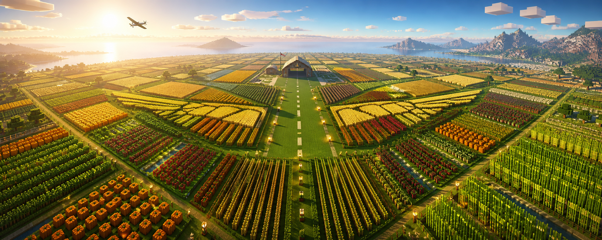

<p align="center">
  
</p>

<h1 align="center">OneMillionCrops</h1>

<p align="center">
  <strong>One million of every crop. One shared challenge. Every harvest counts.</strong>
</p>

<p align="center">
  
  
  <a href="https://github.com/MineWing/one-million-crops/releases/latest"></a>
  <a href="https://github.com/MineWing"></a>
</p>

<p align="center">
  <a href="https://minewing.github.io/one-million-crops/">Documentation</a> ·
  <a href="https://github.com/MineWing/one-million-crops/releases/latest">Download</a> ·
  <a href="#commands">Commands</a> ·
  <a href="#placeholderapi">Placeholders</a> ·
  <a href="#live-web-dashboard">Web dashboard</a>
</p>

OneMillionCrops is a server-wide Paper challenge where everyone contributes toward collecting a configurable target—one million by default—of every enabled crop. Progress is persistent, celebrations are shared, and careful provenance tracking keeps automated farms useful without allowing the same stack to be counted repeatedly.

## Built for a truly shared challenge

| | |
|---|---|
| **One set of totals** | Every participant contributes to the same crop objectives and combined goal |
| **Accurate counting** | Tracks crop provenance through water, pistons, hoppers, storage, partial pickups, and player drops |
| **Live progress** | Animated `/progress` GUI, rotating scoreboard, action bars, milestones, and completion sequences |
| **Web dashboard** | Responsive dashboard with live totals, velocity, objectives, contributors, online players, and recent pickups |
| **Farm tools** | Storage crop wand and a protected two-point farmland planting wand |
| **Safe persistence** | SQLite transactions, autosaves, per-player contributions, and automatic pre-reset backups |
| **Flexible presentation** | MiniMessage action lists for broadcasts, sounds, particles, titles, boss bars, and fireworks |
| **PlaceholderAPI** | Built-in expansion with global, per-crop, and per-player values |

## Counting that stays honest

The default rules support manual and automatic farms while preventing common recount loops:

- Picking up a stack adds the exact amount that entered the inventory.
- Water- and piston-harvested drops retain their provenance through hoppers and storage.
- Eligible crops in chests, barrels, hoppers, and shulker boxes can be inspected or deposited with the Crop Wand.
- Crops deposited by a player are not made eligible again simply by withdrawing them.
- Deliberately dropped items and dispenser/dropper outputs remain ineligible.
- Rebreaking a player-placed crop source does not count until it has genuinely grown.
- Totals clamp exactly at the configured target.

Set `counting.allow-automated-farms: false` to accept only drops traced to mature crops harvested by players. Participant mode defaults to `EVERYONE`; use `ALLOWLIST` with UUIDs for a closed team.

## Player experience

`/progress` opens an animated inventory containing every enabled crop, its current amount, target, percentage, and completion state. `/1mill scoreboard` provides a compact rotating sidebar, while rapid pickups are combined into a single coloured action-bar update.

At configurable intervals, the plugin broadcasts a ranked harvest summary and shows a draining countdown boss bar. Crop milestones trigger sounds, particles, and announcements. Reaching a crop target starts a persisted completion sequence, and finishing every enabled crop launches a separate grand finale.

## Commands

| Command | Purpose | Permission |
|---|---|---|
| `/progress [crop]` | Open the animated progress GUI | `onemillion.progress` |
| `/1mill status` | Print every crop total | `onemillion.progress` |
| `/1mill scoreboard` | Toggle the live sidebar | `onemillion.progress` |
| `/1mill web` | Show the configured dashboard address | `onemillion.progress` |
| `/1mill wand` | Receive the crop storage wand | `onemillion.wand` |
| `/1mill plantwand` | Receive the two-point farmland planting wand | `onemillion.plantwand` |
| `/1mill crops` | Open the crop enable/disable GUI | `onemillion.admin` |
| `/1mill summary` | Inspect the next harvest summary | `onemillion.admin` |
| `/1mill summary now` | Broadcast the harvest summary immediately | `onemillion.admin` |
| `/1mill backup` | Create a timestamped SQLite backup | `onemillion.admin` |
| `/1mill reload` | Reload supported configuration | `onemillion.admin` |
| `/1mill reset <crop> confirm` | Back up and reset one crop | `onemillion.admin` |
| `/1mill reset confirm` | Back up and reset the complete challenge | `onemillion.admin` |

`onemillion.progress`, `onemillion.wand`, and `onemillion.plantwand` are available to everyone by default. `onemillion.admin` defaults to server operators.

## Install

### Requirements

- Paper 1.21.11
- Java 21 or newer
- PlaceholderAPI 2.12.3 or newer (optional)

1. Download the shaded JAR from the [latest release](https://github.com/MineWing/one-million-crops/releases/latest), or build it from source.
2. Place `OneMillionCrops-*.jar` in the server's `plugins/` directory.
3. Restart Paper.
4. Open the challenge with `/progress`.

The plugin creates `config.yml`, `crops.yml`, `messages.yml`, `progress.db`, and `backups/` under `plugins/OneMillionCrops/`. Always install the shaded `OneMillionCrops-*.jar`; an `original-*.jar` does not include SQLite.

## Configuration

| File | Responsibility |
|---|---|
| `config.yml` | Target, participants, counting rules, scoreboard, web server, autosaves, and celebrations |
| `crops.yml` | Enabled crops, item materials, harvest source blocks, and MiniMessage display names |
| `messages.yml` | Ordered action lists for every player-facing event |
| `progress.db` | Shared totals, contributions, completion state, and queued celebrations |
| `backups/` | Manual and automatic pre-reset database backups |

The default catalogue includes wheat, carrots, potatoes, beetroot, nether wart, pumpkins, melon slices, sugar cane, cactus, cocoa beans, bamboo, kelp, berries, chorus fruit, and mushrooms. Crops can be toggled live with `/1mill crops`; disabled progress is preserved.

## PlaceholderAPI

PlaceholderAPI is optional and requires no separate eCloud expansion. Common values include:

| Placeholder | Value |
|---|---|
| `%onemillioncrops_total%` | Total collected across enabled crops |
| `%onemillioncrops_goal%` | Combined target across enabled crops |
| `%onemillioncrops_remaining%` | Remaining amount across the challenge |
| `%onemillioncrops_percent%` | Overall completion percentage |
| `%onemillioncrops_completed_crops%` | Number of completed crops |
| `%onemillioncrops_player_total%` | Viewing player's contribution |
| `%onemillioncrops_crop_<crop>_amount%` | Current amount for a crop |
| `%onemillioncrops_crop_<crop>_remaining%` | Remaining amount for a crop |
| `%onemillioncrops_crop_<crop>_percent%` | Completion percentage for a crop |
| `%onemillioncrops_crop_<crop>_player_amount%` | Viewing player's contribution to a crop |

Numeric placeholders also have `_formatted` variants with thousands separators. Replace `<crop>` with an ID from `crops.yml`, such as `wheat` or `nether_wart`.

## Live web dashboard

The same plugin JAR serves a responsive, read-only React dashboard. Updates arrive over Server-Sent Events without refreshing the page.

| Endpoint | Purpose |
|---|---|
| `/` | Dashboard application |
| `/api/v1/progress` | Current immutable JSON snapshot |
| `/api/v1/events` | Live Server-Sent Events stream |
| `/health` | Lightweight health check |

The listener defaults to `127.0.0.1:8765`. For public access, keep the localhost binding, place an HTTPS reverse proxy in front of it, and configure `web.public-url`. The dashboard exposes no reset, command, database, or server-control endpoint.

## Build from source

```bash
git clone https://github.com/MineWing/one-million-crops.git
cd one-million-crops
cd web && npm ci && npm run build && cd ..
mvn package
```

Node.js 22+ is only required when changing the React frontend. The compiled dashboard is checked into `src/main/resources/web`, so a Java-only `mvn package` includes the latest committed web assets.

The test suite covers target clamping, milestone transitions, contribution tracking, resets, storage wands, planting, database transactions, placeholder values, action parsing, and JSON safety.

---

<p align="center">
  Built by <a href="https://github.com/MineWing">MineWing</a> · See also <a href="https://github.com/MineWing/Rivet">Rivet</a> and <a href="https://github.com/MineWing/EveryBlock">EveryBlock</a>
</p>
